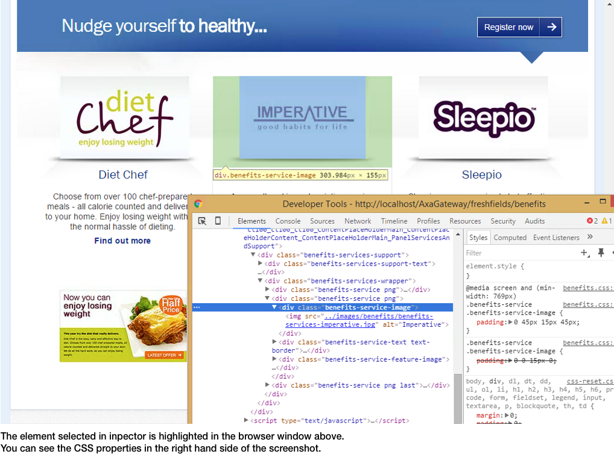
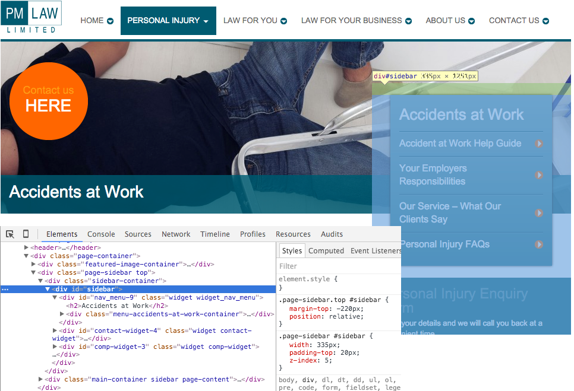
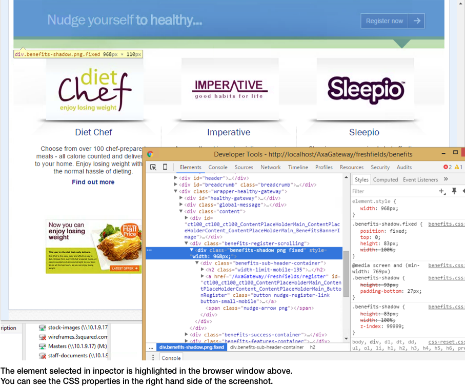
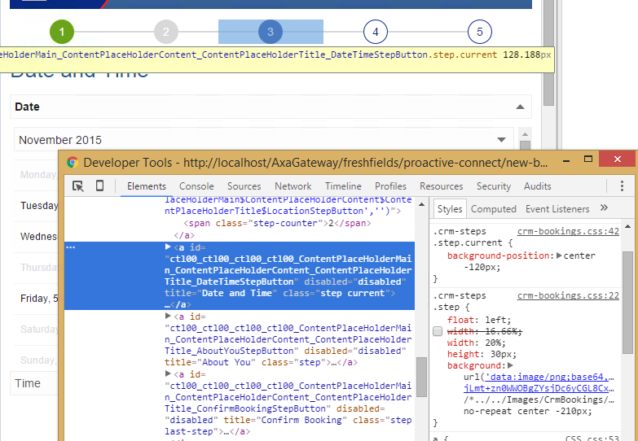
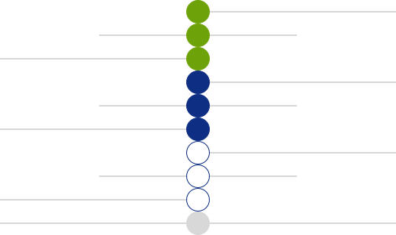
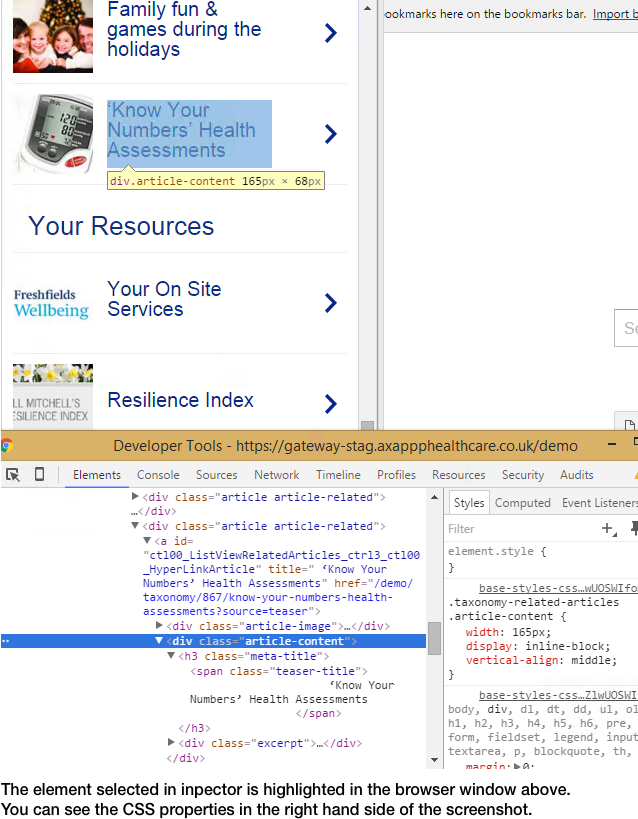
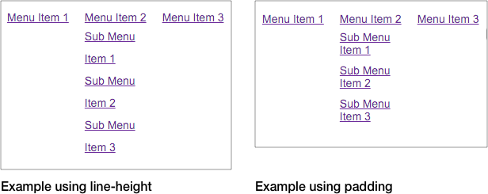

# Table of Contents

1. [CSS - Cascading Style Sheets](#css)
2. [Best Practices](#best-practice)
	* [File Structure](#file-structure)
3. [CSS Selectors](#selectors)
	*  [Specificity](#specificity)
	*  [Use of Important!](#important)
	*  [Efficiency](#efficiency)
4. [Box Model](#box)
	* [Padding](#padding)
	* [Margin](#margin)
	* [Box sizing](#sizing)
5. [Floating](#floating)
	* [Clearing Floats](#clearing-floats)	
6. [Positioning](#positioning)	
	* [z-index](#z-index)	
	* [absolute](#absolute)	
	* [relative](#relative)	
	* [fixed](#fixed)	
	* [top, left, bottom, right](#top-left-bottom-right)	
7. [Images](#images)
	* [Sprites](#sprites)	
8. [Vertical Alignment](#va)
	* [Vertical Centering](#vc)
	* [Inline Block Method](#vc-ib)
	* [Line Height Method](#vc-lh)	
9. [Inline-Block - the rogue 4px margin](#ib-margin)
	* [Position Absolute Method](#vc-pa)
10. [Horizontal Alignment](#ha)
	* [Text Align Method](#ha)
	* [Margin Auto Method](#ha)
11. [Pre-Processing](#pre-process)
12. [Bundling and Minification](#bundle-minify)
13. [Mixins](#mixins)
	* [Retina Image Example](#retina-image)
	* [Border Radius Mixin Example](#border-radius)
14. [Variables](#variables)
15. [Resets](#resets)
16. [Media Queries](#media-queries)
17. [Grid Systems](#grid-systems)
18. [SHIM/SHIV](#sim-shiv)
19. [Menus](#menus)
20. [Two Column Layout](#two-column-layout)
21. [Gotchas](#gotchas)

# <a name="css"></a>CSS - Cascading Style Sheets

Stylesheets are used to align and map HTML elements into a layout on a browser screen.

It defines the look of the site, as well as some levels of interaction and the changing states of elements within the site.

The cascading nature of the file means that the further down the file you get, the more likely that a CSS selector with the same specificity will be applied.

In the case of a minified CSS file, the same hierarchy rules apply to selectors later in the minified text.

However, the chances of CSS styles overriding each other is dependant on the specificity of the selector being applied to an element.

<span style='color:#f00;'>DC to AT: As well as the position within the list does "cascading" not also refer to the priorities of the CSS types, i.e. (1) CSS within files will be overridden by (2) CSS within &lt;style&gt; tags which will be overridden by (3) CSS directly within style attributes of elements? Although (2) and (3) aren't recommended the knowledge may help developers to deduce why some third party item isn't behaving as expected, e.g. if seemingly viable CSS is being ignored by a Telerik control because it has a different value held directly within a style attribute.</span>

## <a name="best-practice"></a>Best Practices
* **Find out the lowest supported browser.** This will dictate what properties can and can't be used. If in doubt check [caniuse.com](http://caniuse.com).

* Some CSS3 elements, such as `border-radius` should still be used, unless specified otherwise. There are a number of libraries and polyfills that can be used to add additional support for new elements.

* Structure the HTML first, or look at the layout to decide what the best and simplest approach would be. Think about floats, padding, margin and positioning. Then write CSS that would be the easiest implementation.

* Use the inspector tools to help understand, and make changes easily, without having to write, save and view each time you make a change. You can then copy the changes applied in the inspector.

* Do not use inline styling.

* Avoid using `display:table;`. It causes more problems than it fixes.

* Don't be afraid to add multiple classes to an element in the HTML markup. By using generic classes it means the CSS output will be smaller.

* Only nested HTML elements with the same display property values, e.g. `block` within `block`, `inline` within `inline`.

	> Note: Wrapping block elements with hyperlinks is now allowed in HTML5. It would still be better rpactice to use inline elements and set their `display` property to `block`.

* Do not use conditional styling e.g. [if lt ie7], ie8 to fix problems, if you have issues then implement a fix that should work in all required browsers. The only main use for conditional tags should be in the use of a shim/shiv polyfill in older browsers.

* Bundling should take care of trying to use one compressed file, but if plugins have their own styling, e.g. jquery ui, mediaelementjs, then the additional files should be also be bundled.

* Use of some non CSS 2.1 specific elements from CSS3 such as `box-shadow` and `border-radius` may be used (check compatibility from [http://caniuse.com/](http://caniuse.com/)), as implementing radiuses with images becomes harder to maintain for dynamic width/heights.

* Prefer the use of class names to ID’s for CSS. This is due to the higher specificity given to ID selectors mentioned in the [specificity](#specificity) section below. (Also see this frightening [example](http://jsfiddle.net/csswizardry/0yb7rque/)).

* Unitless line-height is preferred, as the line height then becomes a multiplication of the font-size. It also allows the child elements to inherit the ratio instead of a fixed computed value of the parent.
<span style="color:#f00;">DC to AT: What is "Unitless line-height"? <a href="https://css-tricks.com/almanac/properties/l/line-height/">https://css-tricks.com/almanac/properties/l/line-height/</a>. FontSize/LineHeight together?</span>

* Avoid using `visibility: hidden;`, as this causes the element to retain it's space in the page, but does not render it on screen. It creates a gap where the element would be shown.

* Try to keep networks requests down, by using sprite images, and bundle files together.

* Avoid duplication of CSS classes and properties within the classes (Visual Studio should highlight this).

* Use shorthand properties where appropriate such as `background`, `margin`, `padding` and `border`.

* Use appropriate block level elements where applicable. Try not to use `divs` or `spans` for titles or making words/lines in text bold.
<span style="color:#f00;">DC to AT: Instead use? `h1`, `h2`...?</span>

* Try not to use heights too much, as this restricts dynamic text sizes and can cause elements to overflow their containers.

* If you have things that share the same styling, either use a single class or using the `,` to apply the style to more than one class.

* Apply widths when floating elements. Some browsers do not handle them without the width very well.

* Consider using .svg format if the browser requirements support it. They have a small file, they scale size, and will not require retina @2x images.

## <a name="file-structure"></a>File structure
1. Import variables, grid (if included) and mixin files.<span style="color:#f00;">DC to AT: What is "grid"? e.g. standard padding sizes, standard colours used throughout the site?</span>

	> Note: Use of @import is generally discouraged, as it causes some performance issues. However, using LESS the compiler automatically includes the imported files in the CSS output.

2. Import reset – recommend using [Normalize.css](https://necolas.github.io/normalize.css/) and changing to a LESS file, as the import would otherwise not be included, and cause performance issues as mentioned above.
3. Import fonts if using hosted fonts. <span style="color:#f00;">DC to AT: How? @font-face?</span>
4. Multi purpose classes - paddings, margins, floats, clears, etc.
5. Elements – unclassed h1, unclassed ul, etc.
6. Components – full components constructed from objects and their extensions.<span style="color:#f00;">DC to AT: What's this?</span>
7. Overrides - anything that needs to remove any margins, etc.

### Code Structure

* Opening and closing braces should be on a new line.

* Properties should be tab indented (4 spaces).

* Properties should be on separate lines, unless the selector only has one property.

* <span style="color:#f00;">Use lower case in general. Exceptions may include file names??...</span>

* Use hyphen-delimited class names (unless using another naming convention).

* <span style="color:#f00;">Add a space after the colon when declaring properties, e.g. `color: #bbb;`</span>

* Use a semicolon after every declaration (LESS should output an error, and will not compile if not included anyway).

* Use shorthand properties where appropriate, e.g. `#fff` not `#ffffff`.

* Drop the `px` when using a 0 value.

### Comments

Comments should be used to explain properties that are not self explanatory, and to also allows you to add context to why you have chosen a specific method of styling. 

Using comments to document the areas of the file also help to navigate the CSS. 

LESS also utilises the `//` syntax, as well as the traditional `/*  */` for commenting. Comments using the double slash syntax will not be rendered in the output of the generated CSS file. This means that the output file does not contain the extra text, and as a result will have a smaller file size. When explaining the code it would be better to use the `//`.

## <a name="selectors"></a>CSS selectors

CSS selectors define what DOM element the properties specified are applied to.

There are three main types of selector we use:

1. **`a, div, body`** - are used for all elements of the given type.
2. **`.class`** - can have multiple uses on a page.
3. **`#id`** - only one unique use on a page.

There are also other selectors that can allow other styling to be applied such as:

1. `*` - applies rules to everything
2. `div > p` - applies to a direct child of the parent 
3. `a:hover, a:active, input:focus` - styles specific states of elements
4. `input[type="checkbox"]` - applies styles specific input type

There are also some other selectors that you may see in CSS files can include:

1. `::before`
2. `::after`

`::before, ::after` - used only in modern browsers <http://caniuse.com/#search=%3A%3Abefore>.

> Note: IE8 supports older CSS 2.1 syntax of single-colon syntax (e.g. :before, :after)

These are pseudo elements that are not included in the HTML markup of a page, but are still controlled in CSS. They are visible when using an inspector tool to view the markup.

They can be used in simple ways such as clearing floats, or they can be used to introduce new elements before and after the content of existing elements. The content of the ::before and ::after pseudo elements can be set in CSS, and the properties can be set like any other element.

A full list of selectors can be seen here: <http://www.w3schools.com/cssref/css_selectors.asp>.
<span style="color:#f00;">DC to AT: Which out of these selectors is it still advisable not to use because of legacy browsers?</span>

### <a name="specificity"></a>Specificity of selectors
There are different types of CSS selector that allow you to style the elements, but they can also be used in different combinations.

Set specificities/combinations of classes and IDs trump others, e.g. single #id beats single .class, two .classes beat a single class. 

As such, explaining what will take priority becomes difficult to explain based in a broader context.

General hierarchy:

`style="" > #ID > .class > element`

In general is is easier to explain and understand by assigning each of the selectors a score when being used.
<span style="color:#f00;">DC to AT: Don't fully understand the scores. Although I have now noticed they explained in the next link below. Later, I after I had read the link, things were much easier to understand.</span>

style, #id, .class, element
[0,0,0,0]

An inline style tag will score a value of [1,0,0,0].

An ID will score a value of [0,1,0,0].

A class or pseudo class will score a value of [0,0,1,0].

An element will score a value of [0,0,0,1].

Example:

1. `span` = [0,0,0,1]
2. `.lorem span` = [0,0,1,1]
3. `p.lorem span` = [0,0,1,2]
4. `p.lorem span.ipsum:hover` = [0,0,3,2]
5. `#footer p.lorem span.ipsum:hover` = [0,1,3,2]
6. `style=""` = [1,0,0,0]
6. `!important` = [1,0,0,0,0,0,0,0,0,0,0] or something

> Note: This is not a foolproof way of working out what selectors will be needed to have a greater priority, and override current selectors. It is merely a way of illustrating the principle.

You can find out more about it here <https://www.smashingmagazine.com/2007/07/css-specificity-things-you-should-know/>.

### <a name="important"></a>Use of !important
Avoid using the !important attribute if you can. Important can override most things, but in turn then becomes even more difficult to override.

Good cases for using it, include the widths of Rad controls, as they automatically add inline styling on numeric textboxes, and other controls for widths.

### <a name="efficiency"></a>Efficiency
The excessive use of generic elements is not recommended, unless they need to have the base styling added, such as hyperlinks. They should otherwise be styled using classes if available.

Using styling such as `div.class-name` is less efficient than just using the `.class-name` selector, as the use of generic elements is less efficient than using a class <span style="color:#f00;">DC to AT: less or more? "generic element" as in `<a>`?</span>.

If elements can be referenced by using a single class, it helps the rendering engine to find and apply the styling. The engine reads the selector from right to left, and therefore has to find all elements with a specific class, then find parents with another specific class, etc.

<br /><span style="color:#f00;">DC to AT: Aren't there some selectors that are particularly inefficient, e.g use of `*`, `>` (descendant selector) or multiple rules chained together of selection like <br />`div.main-content div-sidebar ul.navigation-menu a.home-page` (which sort of looks like good practice as it is very specific)? <br />generally specifying tagName.class-name<br /><a href="https://developer.mozilla.org/en-US/docs/Web/Guide/CSS/Writing_efficient_CSS">https://developer.mozilla.org/en-US/docs/Web/Guide/CSS/Writing_efficient_CSS</a></span>

## Separation of responsibilities
Using classes that are generic enough to be used in multiple places is one of the best ways of minimising the size of a CSS file.

The CSS needs to be both specific and generic at the same time, which means that the classes applied should not override each other too much.

Spacing classes are a prime example of this.

	.padded-horizontal
	{
		padding: 0 10px;
	}
	
	.half-padded-vertical
	{
		padding: 5px 0px;
	}
	
	<div class="padded-horizontal half-padded-vertical"></div>

The above example would result in the incorrect result, because the classes are not independent, and the `.half-padded-vertical-class` would bring unexpected additional styling. 

A better way of doing this would be like the example below:

	.padded-horizontal
	{
		padding-left: 10px;
		padding-right: 10px;
	}
	
	.half-padded-vertical
	{
		padding-top: 5px;
		padding-bottom: 5px;
	}
	
	<div class="padded-horizontal half-padded-vertical"></div>
	
The above example means that the classes do not add any unnecessary styling. When used in this way they only, add the properties needed, and do not interact with each other.

The problem with using classes in this way, means that the CSS file becomes larger. It should however be offset by the fact that the small re-usable pieces of code can be applied together to form the full required styling.

This can also be counter acted to a degree by utilising bundling and minification. The content of the file should then be served as a gzipped file to further compress the content.

## Inheritance
Some of the properties can be inherited from the parent container. Some examples of this are `font-size` and `line-height`. If a group of text needs a font-size setting, it can be set on the parent, and all of the child elements will inherit the font-size, unless explicitly set on those elements.

## <a name="box"></a>Box model
The box model determines the size and layout of the element based on a rectangular reference. The box model helps to workout the flow of elements within a page.

There are 3 different types of display attribute that can affect the size and layout of an element:

1. **`block`** - headings (`<h1>`,...), `<div>`, `<ul>`, `<li>`, `<p>`
2. **`inline-block`** - `<input>`, `<select>`, `<button>`
3. **`inline`** - hyperlinks (`<a>`), `<span>`, `<label>`

Each one of the above display options will allow specific CSS attributes to affect the element in different ways.

Assigned `height`, `width` and vertical `margin` properties will be ignored for *inline* elements as the width and height of these is auto-calculated according to the width of the content.

`display: inline-block;` elements act as *inline* elements, unless any of the box model sizing properties are applied. They will also respect any `margin` properties applied.

`display: block;` elements automatically take up the full width of the parent container, unless otherwise set.

`height` values are auto-calculated based on the line height and content heights across all elements, based on the box model positioning.

### <a name="padding"></a>Padding
Padding can be used for a variety of uses. Some examples include: spacing elements away from others, allowing background images to be seen, as in the example below.



It is applied in 4 values: **top, right, bottom, left**. e.g padding: 10px 8px 7px 6px;

The values can be provided in a number of different units: px, %, em.

When using em, the size is dependant on the font-size, and the percentage value is a percentage of the width.

It can be shortened to just two values as the vertical padding (both top and bottom), and the horizontal padding. e.g padding: 10px 5px;

Padding can also be added by using the `padding-(left/right/top/bottom)` property individually.

### <a name="margin"></a>Margin
Margins are also used for spacing. They are useful for changing layouts, by changing the spacing between elements. Having two margins together makes them collapse. The space between the two elements with margins, will be size of the largest margin.

	.item
	{
		margin: 10px 5px 20px 5px;
	}
	
	<div class="item">
		<p>Lorem ipsum dolor</p>	
	</div>
	<div class="item">
		<p>Lorem ipsum dolor</p>	
	</div>
	
The margin between the two elements in the above example will collapse to be 20px rather than the sum of both margins.

The syntax of margins is the same as mentioned above in padding, using 4 values: top, right, bottom, left. e.g padding: 10px 8px 7px 6px; or two values as the vertical margin, and the horizontal margin. e.g margin: 10px 5px; Margins can also have individual properties using the same `margin-(left,right,top,bottom)` syntax.

Unlike padding, margins can have a negative value to change the original position of the element.

They can also be used in conjunction with `position: relative;` to allow layering of elements, but still keep the main layout as seen below.



### <a name="sizing"></a>Box-sizing:
Box-sizing is what defines the height and width that an element has, based on the CSS attributes and options. It is this that is used to form the rectangular box model.

default: `content-box`;
options: `border-box`;

The `content-box` option defines the given width of the elements as:

**Calculated Width** = CSS defined width

`border-box` defines the width of the elements as: 

**Calculated Width** = CSS defined width + padding-left + padding-right + border-left + border-right

> **Note: margins sit outside the calculated width and need to be taken into consideration for layouts**

> Note: IE8 and below include padding and border values in the width of the element, which acts as the `border-box` option. This can be solved by using the HTML 5 doctype:
```<!DOCTYPE html>```

## <a name="floating"></a>Floating
Floating allows text and elements to be aligned and wrapped around each other within the normal flow of the box model. It is also useful for creating column layouts. The floated elements will be aligned to the left or right of the parent container based on the chosen `float` option.

default: `none`;
options: `left` | `right`

Floats are one of the easiest ways to move elements to the left, and right. Sometimes relative and absolute positioning can be more advantageous based on the design. Cases for using positioning can include varying heights. 

Floating example:

	.left
	{
		float: left;
	}
	
	.margin
	{
		margin: 10px;
	}
	
	.overflow-hidden
	{
		overflow: hidden;
	}
	
	<div class="overflow-hidden">
		<h1>Title of the page</h1>
		
		<p>Lorem ipsum dolor sit amet, consectetur adipiscing elit. Cras purus velit, vulputate eget lectus sed, auctor commodo nibh. Nunc in nunc lacus. Aliquam erat volutpat. Nulla erat purus, interdum id sagittis sed, commodo id est. Nam volutpat commodo ultrices. In feugiat posuere euismod. Nulla dolor diam, pretium et convallis a, vulputate eget sapien. Sed massa velit, accumsan eu commodo quis, bibendum vel leo.</p>
		<p>Integer consequat eros ex, quis iaculis massa maximus sit amet. Vestibulum consequat augue eget tempor gravida. Phasellus efficitur elit a justo dignissim, eu semper velit ultrices. Nullam ac odio ac turpis ullamcorper lacinia. Duis nec nisl vel leo hendrerit pharetra a eu nisi. Phasellus viverra, enim ac suscipit blandit, ante nisl ornare turpis, sed dictum turpis dolor vel tellus. Vestibulum varius dapibus elit vel malesuada. Duis feugiat justo vel augue commodo, sit amet mattis metus gravida. Phasellus vitae pharetra tellus. Phasellus imperdiet arcu maximus urna pharetra, sit amet rhoncus mauris mattis. In luctus lorem sed tellus interdum ullamcorper. In efficitur sodales lectus sed elementum. Etiam vel diam eget urna mollis volutpat non at ante. Nullam sed nisl vehicula, suscipit sem nec, varius turpis. Fusce sodales risus vel cursus blandit. Cras sollicitudin sodales orci, ac ullamcorper tortor tempus id.</p>
	</div>

A floated element should always have the float cleared, as this can cause layout issues with elements being stacked directly underneath the floated elements, as floated elements are positioned based on their order in the markup.

> Note: the position of the floated elements in the markup is important, as it is the markup position that will determine where the top of the floated element aligns to.

<a name="clearing-floats"></a>Clearing floats:
There are a few different ways of clearing floats, e.g. `overflow: hidden` or a `<div>` with `clear: both`.

	.right
	{
		float: right;
	}
	
	.clear
	{
		clear: both;
	}
	
	<div>
		
		<p>
			Lorem ipsum dolor sit amet, consectetur adipiscing elit.
		<p>
		<div class="clear"></div>
	</div>

>Note: be careful using `overflow: hidden;`, as this will clip anything inside of the element. This means you have to be careful when the element has absolute positioned elements within.

## <a name="positioning"></a>Positioning
Positioning allows elements to be moved outside of where they would usually sit in the markup. Using some of the options available allows the element to be removed from the normal flow of the box model. It is useful for making elements sit over the top of one another, and can also be used to move the position that the element would normally be placed.

default: `static`;
options: `fixed` | `absolute` | `relative`


### <a name="z-index"></a>z-index
Using the positioning options _other than the default static option_ cause a `z-index` property to be created on the element, and remove the element from the flow of the document.

The newly created z-index acts exactly like an [x,y,z] z co-ordinate. It acts as a depth co-ordinate on the page. A higher z-index will result in the element being closer to the theoretical front of the monitor.

Elements further down the page with using the positioning properties will have a higher z-index (if no z-indexes are explicitly set within a CSS document), and be layered above the previous elements.

### <a name="absolute"></a>absolute
The `absolute` option, means that element is positioned within the nearest parent with the `relative` option. If none exists it will be positioned according to the browser window.

> Note: Positioning using the absolute option, will be done to the nearest relatively positioned parent element.

### <a name="relative"></a>relative
The `relative` option allows the element to be offset from it's original, natural position.

### <a name="fixed"></a>fixed
The `fixed` option sets the position of the element according to the browser window regardless of scrolling.

### <a name="top-left-bottom-right"></a>top, left, bottom, right
Positioning requires, a `top`, `left`, `bottom`, `right` or combination of positions to be set. Without them, the element will not move from its default position.

The `top` position works by setting the top of the `absolute` element, the specified distance away from the top of the parent `relative` element, i.e. it moves the element down when using a positive value. The `bottom` property works in the opposite way and moves the element the given distance up from the bottom of the parent when using a positive value. `left` will actually move the element right, and `right` moves the element left when using positive values.

The values given for the `top`, `left`, `bottom`, `right` positions can be negative to move the position of the `absolute` child element outside the bounds of the parent element.

Fixed position scrolling can be achieved, using a combination of JavaScript and the `fixed` option. You can see an example of this below.



## <a name="images"></a>Images
Images can be both inline within the HTML, and used as a background image.
<br /><span style="color:#f00;">Images can be included either via `` tags, within the HTML, or via CSS, by specifying a background image.</span>

Background image example:

	.background-icon
	{
		background: #fff url(images/sample_image.png) no-repeat left center;
	}
	
The above example is the shorthand declaration for the background property.

It compromises of:

* `background-color`
* `background-image`
* `background-repeat`
* `background-position`

They are represented in the shorthand version, in the list order above.

> Note: the `left` and `center` attributes contribute to the one single `background-position` property.

Responsive image example:

	img
	{
		max-width: 100%;
		height: auto;
		display: inline-block;
	}
	
	
	
Always try to use the smallest file size you can achieve without loosing too much quality.

In general the .png file size is greater than .jpg. Images can be further optimised using the Visual Studio Web Essentials, or similar plugin.

.png files with transparency will have an even greater file size than that of a non-transparent png, but allows the added flexibility of changing background colours.

> Note: Photoshop does a better job at compressing .pngs than fireworks. 

### Retina images

High DPI screens require a larger image size. This can be achieved by using a 2x/3x scale image with the same height, and width values as the original image size.<span style="color:#f00;">What's 2x/3x? 2x or 3x</span>

Retina background example:

	.background-icon
	{
		background: #fff url(images/sample_image.png) no-repeat left center;
		
	    @media (-webkit-min-device-pixel-ratio: 1.5),
	    (min-resolution: 144dpi)
	    {
	        background-image: url(../images/sample_image@2x.png);
	        // The background size is set to the original 1x scale image.
	        background-size: 7px 10px;
	    }
	}
	
> Note: the `@media` query is there for higher DPI screens. The `background-size` property is used to scale the image into the same dimentions as the original 1x scale image.

With the increased image dimensions, there will also be an increase in file size.

The extra file size of large files has to be served through longer http requests from the server and causes page to render slower.

Slower rendering is also true when using multiple different images for different a number of different states on on the same element, e.g. :hover, :active, etc.

### <a name="sprites"></a>Introducing..... Sprites!

An image sprite is the collection of multiple images within one image file.

This reduces the amount of requests the browser makes to the server, and will load all of the images within the sprite at the same time. When using individual image files for each state there may be a slight lag when, for example, a user first moves the mouse over an element which then requires a hover state image to be loaded.

Using a sprite means that a common class can be used to define the background image. Then specific and unique classes are used to move the background position of the image to display the section of the image required.

Here is an example of a sprite image in use:



This is the sprite image used in the above example:



<span style="color:#f00;">The example may be quite complex but is still a good one.Maybe point out that incomplete steps are green, current step is blue, incomplete steps are white and disabled (skipped) steps are grey. Also why some vertical offsets are +ve and some are -ve.</span>

> Note: The horizontal lines in the example sprite image should stretch across the full width of the image.

A sprite uses only one network request, which in turn means less server processing, and shorter page render time. Using sprites also usually means smaller overall file size compared to individual files.
 
It also means that all the icons/states of images will be loaded at the same time.

Example using a sprite image (LESS file, including retina image):

    .step
    {
        float: left;
        width: 20%;
        height: 30px;
        background: url(Images/CrmBookings/crm_step_process_background_sprite.png) no-repeat center -210px;
        
        @media only screen and (-webkit-min-device-pixel-ratio: 1.5), only screen and (-o-min-device-pixel-ratio: 3/2), only screen and (min--moz-device-pixel-ratio: 1.5), only screen and (min-device-pixel-ratio: 1.5) {
            background-image: url(Images/CrmBookings/crm_step_process_background_sprite@2x.png);
            //background-size is set to the original 1x image size to scale the image
            background-size: 504px 300px;
        }

        &.last-step
        {
            background-position: center -240px;
        }

        &.first-step
        {
            background-position: center -180px;
        }

        &.current
        {
            background-position: center -120px;

            &.first-step
            {
                background-position: center -90px;
            }

            &.last-step
            {
                background-position: center -150px;
            }
        }

        &.completed
        {
            background-position: center -30px;

            &.first-step
            {
                background-position: center 0;
            }

            &.last-step
            {
                background-position: center 60px;
            }
        }

        &.skipped
        {
            background-position: center bottom;
        }
    }	

> Note the `&.` in LESS is used to chain the class with the parent class. For example, the `&.skipped` above, when compiled, will be combined with the `.step` in the outer scope resulting in the CSS rule `.step.skipped`, i.e. matching elements must have both classes.

## <a name="va"></a>Vertical alignment

Designs are sometimes sent that involve two elements being vertically aligned with each other. This can sometimes involve text and an image, or a label and a text field.

### <a name="vc"></a>Vertical Centring
Vertical centring can be achieved in a couple of different ways. The different techniques, would depend on the situation being displayed.

If one of the elements has a fixed size, and the elements are layered over the top of the other, then the positioning method is the best.

If the elements are side by side, then the line height or inline-block methods would work well.

### <a name="vc-ib"></a>The inline-block method
The following code would be used on each element that would be required to vertically align within the centre of each other, when the elements are next to each other.
	
	.vertical-middle
	{
		display: inline-block;
		vertical-align: middle;
	}
	
> Note: This method will only work if the two elements are sitting next to each other with a wrapping container.

> Note: If the text does not have a specific length, a width is sometimes required to allow the text to span across multiple lines, as can be seen in the example below.



### <a name="vc-lh"></a>Line height method
If the elements that need to be aligned next to each other are just small pieces of text, that will always be on one line, and the width of the 2 elements will not exceed the width of the parent container.

### <a name="vc-pa"></a>Position absolute method

The position absolute method requires the parent container to have `position` attribute set and the element being overlaid to have `position: absolute;`. The usual preferred option is `relative`, as not setting a `top`, `bottom`, `left` or `right` offset leaves the parent element in it's original position.

	.relative
	{
		position: relative;
	}
	
	.absolute
	{
		position: absolute;
		display: block;
		height: 30px;
		width: 30px;
		top: 50%
		/* Half the element height */
		margin-top: -15px;
		left: 0;
	}
	
This method works well as the `top: 50%;` value allows the parent container to have a variable height.

The same method can be used to horizontally align the element too. The `top: 50%;` value should be switched for `left: 50%;` and the `margin-top` property should be substituted for `margin-left` with the value set to half the width of the element.

## <a name="ib-margin"></a>Inline-block - the rogue 4px margin
When using `display: inline-block;` there may be inconsistent margin/positions of elements due to a known implementation of the specification, which affects how HTML renders inline block/ block parent and child elements.
<span style="color:#f00;">DC to AT: last bit?  HTML renders inline-block, block parent and child elements</span>

A small gap is created when elements are set as `display: inline-block;`, if the elements are on completely separate lines in the markup. This is due to the **whitespace between the lines** of the elements being classified as an inline-block HTML element.

The whitespace is dealt with like this because content the parent container would otherwise contain a mixture of inline and inline block content so, to work out positions based on the box model, the whitespace becomes an inline block element too.

One of the fixes for this is to start and end elements on the same line, e.g.

	<div>
		<span class="inline-block">
			lorem ipsum
		</span><span class="inline-block">
			Lorem ipsum
		</span>
	</div>

The items could also be floated to avoid this problem, but floating would need to be evaluated against vertical alignment, etc., within the design.

Other fixes include negative margins, or setting the font size of the parent container to zero, and then re-setting it on the child elements. Each of these fixes would obviously require more code to combat the issue, and may require very specific placement in the markup.

> Note: Reformatting code using ReSharper would set the elements on different lines and re-introduce the 4px gap issue, so be careful.

## <a name="ha"></a>Horizontal alignment
`inline` and `inline-block` elements can be centrally aligned by using `text-align` on the parent container.

> Note: margins on `display: inline-block;` will also be taken into account when aligning the items and, as such, the items may not appear aligned if unequal margins are applied to each side.

Block level elements can be centrally aligned, but they will require a width, and `margin-left` and `margin-right` set to `auto`.

# <a name="pre-process"></a>Pre-processing
Using LESS pre-processing means that you can re-use multiple selectors, minify the output and use variables for attributes such as colours, fonts and sizes.

This allows greater control when the styling needs changing.

The pre-processor we use is [LESS](http://lesscss.org/). The full set of available features and functions may not be available to us as the latest version may not be included in the Visual Studio extensions used.

Since LESS files are not natively supported by browsers they have to be pre-compiled before being added into the site. In Visual Studio 2013 this can be done with the Web Essentials 2013 extension.

It can be found here: <https://visualstudiogallery.msdn.microsoft.com/56633663-6799-41d7-9df7-0f2a504ca361>

Studio 2015 will require the Web Compiler extension instead.

It can be found here: <https://visualstudiogallery.msdn.microsoft.com/3b329021-cd7a-4a01-86fc-714c2d05bb6c>

## <a name="bundle-minify"></a>Bundling and minification
Bundling and minification should be handled within the web application itself.

However, if bundling and minification are not implemented in the project with no time to add them, Web Essentials/Web Compiler can also perform the minification for you.

## <a name="mixins"></a>Mixins in LESS
Mixins are a good way to reuse code, whilst changing the values/colours/images required.
They are essentially functions that allow overridable default parameters which, when compiled to CSS, give the raw output from within the mixin.

## <a name="retina-image"></a>Retina image example:

Usage in LESS file:

	.image
	{
	    background: url(../Images/background-image.jpg) no-repeat left center;
	
	    .retina-image("background-image@2x.jpg","24px","24px");
	}

Resulting CSS:

	.image
	{
		background: url(../Images/background-image.jpg) no-repeat left center;
	}
	
	@media (-webkit-min-device-pixel-ratio: 1.5), (min-resolution: 144dpi)
	{
		.image
		{
			background-image: url(../Images/@retina-image);
			background-size: "24px", "24px";
		}
	}
<span style="color:#f00;">DC to AT: I don't completely follow how this one.</span>

## <a name="border-radius"></a>Border radius mixin example:
Use of border-radius is recommended over the use of images with rounded corners, unless the client specifically wants rounded corners across legacy browsers. See example below:

LESS mixin definition:

	.border-radius (@radius: 5px 3px 4px 2px) {
		-webkit-border-radius: @radius;
		-moz-border-radius:    @radius;
		border-radius:         @radius;
	
		-moz-background-clip:    padding;
		-webkit-background-clip: padding-box;
		background-clip:         padding-box;
	}
	
Usage in LESS:

	.popup
	{
		.border-radius(4px);
		
		.popup-icon
		{
			.border-radius;
		}
	}

Resulting CSS:

	.popup {
	  -webkit-border-radius: 4px;
	  -moz-border-radius: 4px;
	  border-radius: 4px;
	  -moz-background-clip: padding;
	  -webkit-background-clip: padding-box;
	  background-clip: padding-box;
	}
	.popup .popup-icon {
	  -webkit-border-radius: 5px 3px 4px 2px;
	  -moz-border-radius: 5px 3px 4px 2px;
	  border-radius: 5px 3px 4px 2px;
	  -moz-background-clip: padding;
	  -webkit-background-clip: padding-box;
	  background-clip: padding-box;
	}

## <a name="variables"></a>Variables
Variables in LESS can be used to store colours, font sizes and a variety of other attributes.
Using variables makes amending the easier, as then only have to change in one place and re-compile CSS file from LESS. You can put all standard definitions of this nature in a LESS file of their own.

# <a name="resets"></a>Resets
A CSS reset can be used to remove default CSS properties from being applied to the pages, such as default page margins and padding.

A full reset will mean that you have to re-apply paddings, margins and bullet styles to list items, headings, etc.

This then causes more work as there may be a need to re-apply some of that styling later.

To stop this from happening we can use a CSS reset file called **Normalize**: <https://necolas.github.io/normalize.css/>.

Normalize is a form of reset that doesn't remove all of the default properties, only select ones that aren't necessary. It also creates consistency across browsers.


# <a name="media-queries"></a>Media queries
There are a variety of media queries which can be used to check the capabilities of a device. This means that CSS can be changed depending on the size, orientation, pixel ratio and media of the device.

Media queries are useful for responsive designs within a single stylesheet. They allow you to have styling apply only within set parameters, based on the capabilities mentioned above.

Responsive example:

	.page-wrapper
	{
		width: 320px;
		box-sizing: border-box;
		margin: 0 auto;
	
		@media screen and (min-width: 321px)
		{
			width: 100%;
		}
	
		@media screen and (min-width: 1025px)
		{
			width: 1024px;
		}
	}

Then can also be used to add higher resolution images for high DPI screens. Different browsers implement ways of checking for high DPI screens, as can be seen in the example below:

	.notice-icon
	{
        border: 1px solid @border-colour;
        background-image: url(@icon);

		@media (-webkit-min-device-pixel-ratio: 1.5),
		(min-resolution: 144dpi)
        {
			background-image: url(@icon-retina);
			background-size: 24px 24px;
		}
	}

# <a name="grid-systems"></a>Grid systems
Grid systems mainly contain a wrapping div for each row and floated divs, with a fixed width, for the containers. They usually have some padding combined with `box-sizing: border-box;` to compensate for the extra width added by the padding.

This allows the width to be set as a fixed value, or a percentage width, without worrying about the additional padding, as it is already included in the width specified.

The fact that the containers are floated means that there needs to be some form of float clear.

The padding on the containers means that a spacing gutter can be introduced to add even spacing between elements. The fact that the containers are using `box-sizing: border-box;` means that the spacing gutter can be a variable size whilst the containers still maintain the given width.

Grid example:

	// The padding size is set to half of the gutter size.
	// This is bacause the gutter is being implemented as padding,
	// and therefore will have the width of two sets of padding to
	// form a gutter inbetween the columns.
	//
	// It is for the same reason that the container also has half
	// the horizontal padding applied.
	
	@padding-size: 10px;
	
	.column-container
	{
		overflow: hidden;
		padding-left: @padding-size;
		padding-right: @padding-size;
	
		.column
		{
			float: left;
			padding-left: @padding-size;
			padding-right: @padding-size;
			box-sizing: border-box;
	
			&.column-1{ width: 6.25%; }
			&.column-2{ width: 12.5%; }
			&.column-3{ width: 18.75%; }
			&.column-4{ width: 25%; }
			&.column-5{ width: 31.25%; }
			&.column-6{ width: 37.5%; }
			&.column-7{ width: 43.75%; }
			&.column-8{ width: 50%; }
			&.column-9{ width: 56.25%; }
			&.column-10{ width: 62.5%; }
			&.column-11{ width: 68.75%; }
			&.column-12{ width: 75%; }
			&.column-13{ width: 81.25%; }
			&.column-14{ width: 87.5%; }
			&.column-15{ width: 93.75%; }
			&.column-16{ width: 100%; }
		}
	
	}	
	
	<div class="column-container">
		<div class="column column-4">
			<span>
				Lorem ipsum dolor
			</span>
		</div>
		<div class="column column-8">
			<span>
				Lorem ipsum dolor
			</span>
		</div>
		<div class="column column-4">
			<span>
				Lorem ipsum dolor
			</span>
		</div>
	</div>

## <a name="shim-shiv"></a>SHIM/SHIV
If IE < 9 support is needed, a SHIM/SHIV polyfill will be required.

This polyfill to allow HTML 5 (header, footer, canvas) elements in older browsers e.g. IE8.

    <!--[if lt IE 9]>
	    <script src="http://html5shim.googlecode.com/svn/trunk/html5.js"></script>
    <![endif]-->
    
This also forces some older versions of IE into quirks mode and fixes some issues with browser implementations of different doctypes. 

## <a name="menus"></a>Menus
Menu items are best constructed using list items. This is due to the fact that the natural set of links together are a list of links <span style="color:#f00;">DC to AT: What are you trying to say?</span>. It then allows the list items to be used for the layout of the menu and the links to be styled for presentation.

Below is a basic example of a horizontal menu with drop downs:

	.menu
	{
		padding: 0;
		margin: 0;
		// The height is set, because the float cannot be cleared using `overflow:hidden` to give the menu a height, as the positoned sub menu would not be shown.
		height: 28px;
	
		.menu-item,
		.sub-menu
		{
			list-style-type: none;
			margin: 0;
			padding: 0;
		}
	
		.menu-link
		{
			display: block;
		}
	
		> .menu-item
		{
			float: left;
			position: relative;
	
			> .menu-link
			{
				padding: 10px;
				display: block;
			}
	
			&:hover
			{
				.sub-menu
				{
					display: block;
				}
			}
		}
	
		.sub-menu
		{
			display: none;
			position: absolute;
			top: 28px;
			left: 0;
			width: 100px;
	
			.menu-link
			{
				padding: 5px 10px;
			}
		}
	}

	<ul class="menu">
		<li class="menu-item"><a href="" class="menu-link">Menu Item 1</a></li>
		<li class="menu-item">
			<a href="" class="menu-link">Menu Item 2</a>
			<ul class="sub-menu">
				<li class="menu-item"><a href="" class="menu-link">Sub Menu Item 1</a></li>
				<li class="menu-item"><a href="" class="menu-link">Sub Menu Item 2</a></li>
				<li class="menu-item"><a href="" class="menu-link">Sub Menu Item 3</a></li>
			</ul>
		</li>
		<li class="menu-item"><a href="" class="menu-link">Menu Item 3</a></li>
	</ul>

It is better to use padding, not line-height to set the full height of menu items. If the width of anything changes this can cause text wrapping. Setting the height as padding will allow the height to change, whilst the vertical spacing between the elements remains the same.



## <a name="two-column-layout"></a>Two column layout
A nice way of creating a two column layout, with one column size fixed.

One of the elements has to have a fixed width, such as an image. The other column can then have a flexible width.

	.column-wrapper
	{
		overflow: hidden;
	}
	
	.column-left
	{
		float: left;
		width: 300px;
	}
	
	.column-right
	{
		// The margin-left width is set to the same size of the
		// left column, with extra padding so the two columns 
		// do not touch each other.
		margin-left: 310px;
	}
	
	<div class="column-wrapper">
		<div class="column-left"></div>
		<div class="column-right"></div>
	</div>

The `column-wrapper` is there to clear the float.

The `width` and `margin-left` values could be switched for percentages to allow for flexible browser widths on both columns.

> Note: The `margin-left` is set to a higher value to add spacing between the two columns. This is not always necessary.

# <a name="gotchas"></a>Gotchas
1. Not clearing floats. [More...](#clearing-floats)
2. Setting elements to `inline-block` creates a 4px gap if items are on new lines. [More...](#ib-margin)
3. Setting `overflow: hidden` on a relative element whose absolute positioned child element strays outside the boundary of the parent (causes clipping). [More...](#clearing-floats)
4. % height set on element will only work if the parent has a set value height.
5. Margins need to be considered as part of the element's width/height. [More...](#sizing)
6. Setting heights for variable content size.
7. Using `line-height` for variable content size. [More...](#vc-lh)
8. Not using a reset. [More...](#resets)
9. The order of floated elements is not correct. [More...](#floating)
10. Doctype is not html 5. [More...](#sizing)

